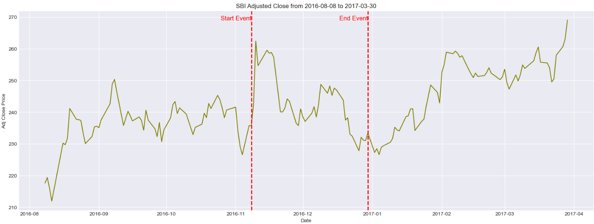
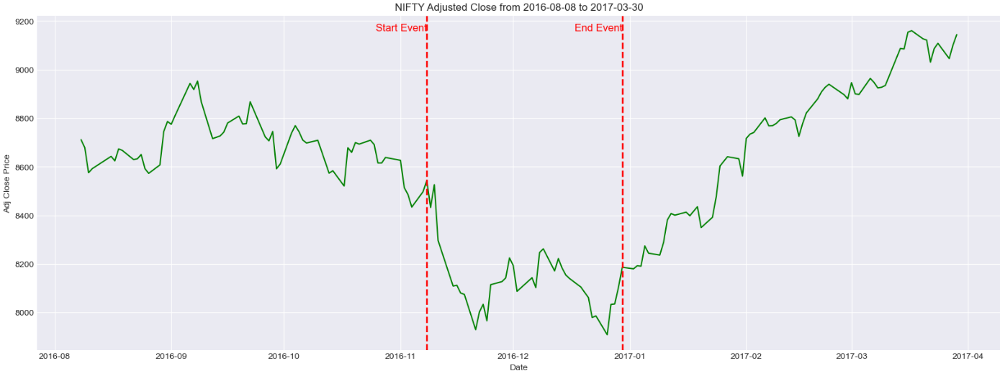
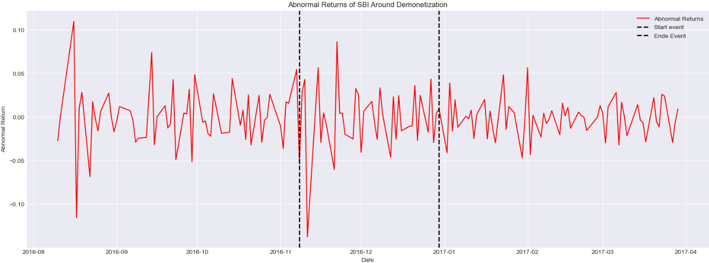
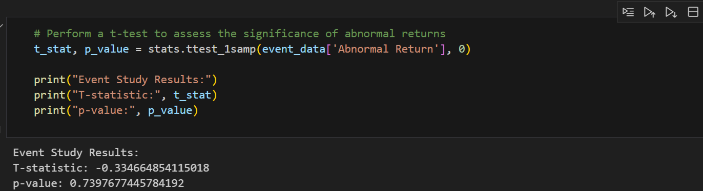

# Event Study Analysis of Demonetization and Its Effects on SBI Index

### Steps Involved

1. Data Collection and Preparation
2. Calculate Returns
3. Estimate Normal Returns
4. Calculate Abnormal Returns
5. Statistical Analysis
6. Visualization

### Plot the adjusted closing prices of SBI and Nifty 50 with interval of event defined

 

### Plot abnormal returns around the event date

### Interpretation and Result

Interpretation
Statistical Significance: The p-value of 0.740 is much larger than typical significance levels (0.05 or 0.01). This means there is no statistically significant evidence to suggest that the demonetization event had a significant impact on SBI’s abnormal returns.

Practical Implication: Given the high p-value, the analysis indicates that the observed abnormal returns around the demonetization event are likely due to random fluctuations rather than a true impact of the event. In other words, the event did not have a notable effect on SBI's stock price in the short term, according to this analysis.