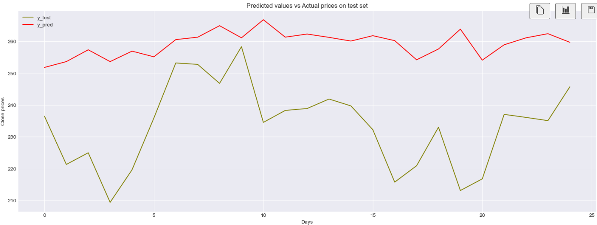
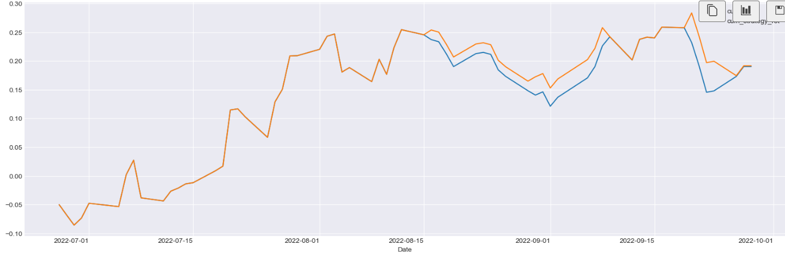

# Developing a Sentiment-Based Trading Strategy Using Natural Language Processing

1. Data Collection: Dataset contains tweets related to 25 different stocks and we select tweets focusing on Tesla for this project.
2. Data Cleaning: Clean the tweets and calculate sentiment scores using TextBlob.
3. Stock Data Extraction: Extract Tesla’s closing prices corresponding to the dates of the tweets.
4. Technical Indicators Calculation: Compute technical indicators (EMA, OBV, RSI) using TA-Lib.
5. Feature Preparation:
    * Include features: 'Date', 'Open', 'High', 'Low', 'Close', 'Adj Close', 'Volume', 'ema_short', 'ema_long', 'rsi', 'obv', 'tweet_sentiment'
    * Use 'Close_nxt' as the target variable.
6. Model Training:
    * Apply TimeSeriesSplit with 5 splits for cross-validation.
    * Train a RandomForestRegressor with 20 estimators, 'sqrt' max features, and a max depth of 10.
7. Model Evaluation: Calculate model scores and metrics.
8. Signal Generation: Use the model to predict values and generate buy/sell signals.
9. Performance Evaluation:
    * Sharpe Ratio: 1.54
    * Average Cumulative Return: 0.1374
    * Average Strategic Cumulative Return: 0.1465
    * Percentage returns without strategy : 24.04 %
    * Percentage returns with strategy : 24.17%

### Plot of Actual and Predicted values

### Plot of Cumulative and Cumulative Strategic Returns

 